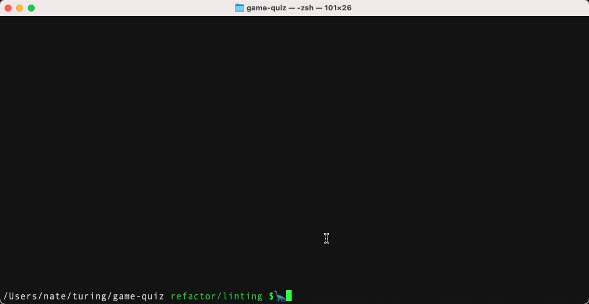

# TERMINAL FLASHCARDS
Mod 2 - First Solo Project

## Table of Contents
  - [Abstract](#abstract)
  - [Technologies](#technologies)
  - [Code Architecture](#code-architecture)
  - [Illustrations](#illustrations)
  - [Install + Setup](#set-up)
  - [Contributors](#contributors)
	- [Wins](#wins)
	- [Challenges + Improvements](#challenges-+-Improvements)
  - [Project Specs](#project-specs)

## Abstract
  - The purpose of this project was to practice implementing Test-Driven Development by writing tests for our JavaScript before writing functionality to help ensure SRP design and prevent bugs. The end result is a little flashcard quiz which can be played in the terminal -- and a whole host of test suites that ensure it is functioning correctly!

## Technologies
  - Javascript
  - Atom
  - eslint

## Code Architecture
  - JavaScript

## Illustrations

  - 

## Install + Setup
  - If you're interested in practicing with these flashcards, clone this repo to your local machine, then `cd` into the appropriate directory and type `node index.js`. Then enjoy quizzing yourself on array iterator methods! You can use the arrow keys to change the highlighted answer, then hit return to make your selection.

## Contributors
  - [Nate Ewert-Krocker](https://github.com/newertkrocker)

## Wins
  - This project helped me become more confident in writing test suites and was excellent practice for Test Driven Development. My tests saved me many a time!
  - This was my first time using eslint to clean up my code, and I have to say I really appreciate the convenience of a linter!

## Challenges + Improvements
  - I wasn't able to complete any of the optional extensions for this project -- I'm confident that I could manage them with additional time, but a quick turnaround deadline meant I had to cut my losses and focus on polishing up a MVP.
  - Although I feel pretty confident that the tests I wrote help ensure basic correct functionality, I would have liked to have been more thorough in seeking out more happy/sad paths and edge cases. Again, the short turnaround time made it hard.

## Project Specs
  - The project spec & rubric can be found [here](https://frontend.turing.edu/projects/flash-cards.html)
